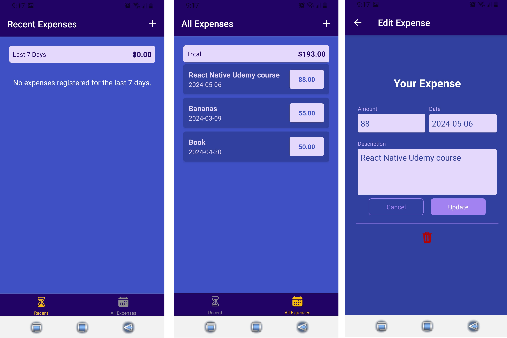

# ExpenSee

React Native app allows to manage expenses.

### Features of App

- There several screens where user can view recent expenses and all expenses
- User can add expenses
- User can update and delete expenses

### Tech Stack

- React Native
- Expo
- React Navigation package
- Firebase as a backend server
- Fetch

### Pages

All expenses screen | Recent esxpenses screen | Add expense screen | Edit expense screen

---

Feel free to install and play with this project.

Link to install app for Android devices -
<a href='https://expo.dev/accounts/olekpavlyk/projects/ExpenSee/builds/825352b7-e6c1-4ad1-b5c1-fd2825e25757'>Download 'ExpenSee App'</a>
